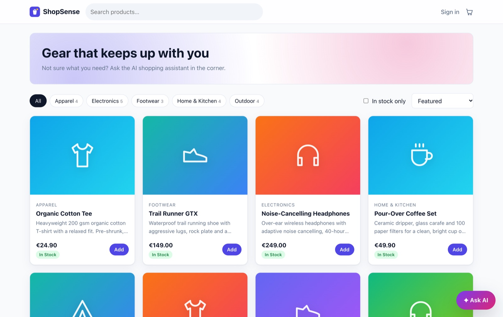
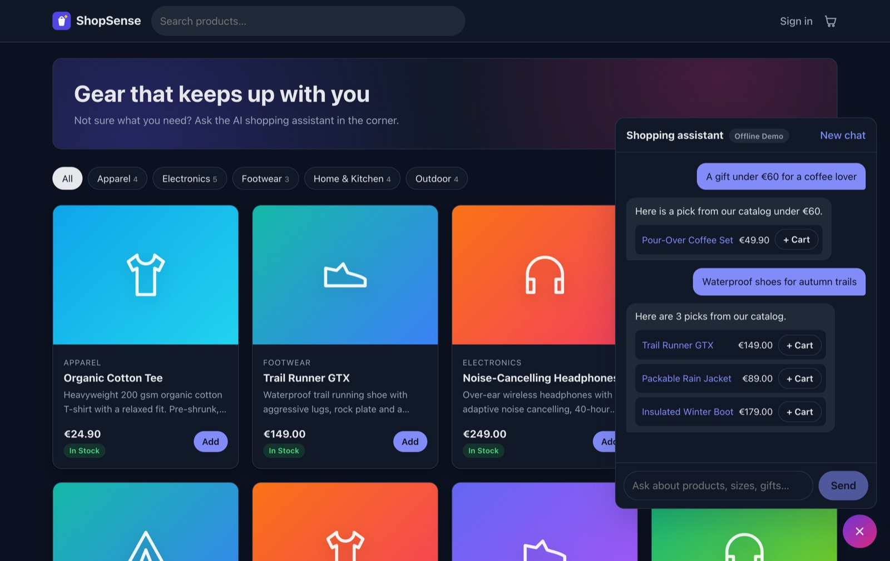
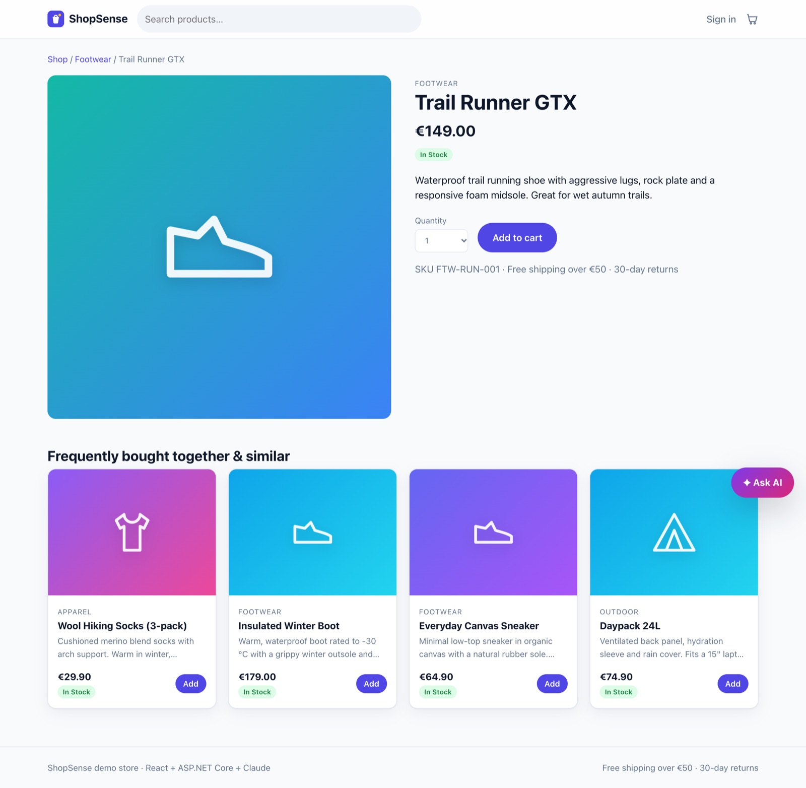
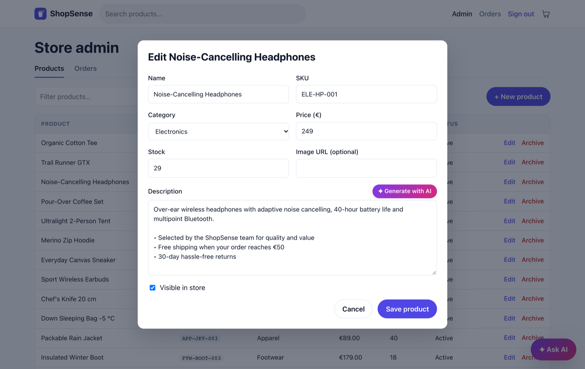
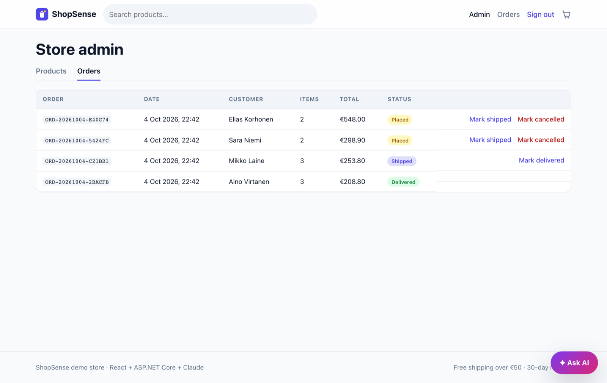
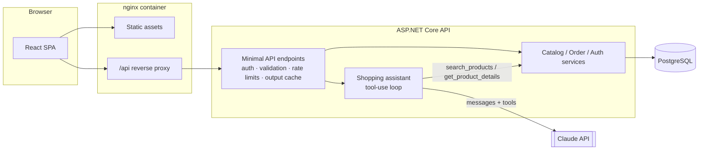

# ShopSense: AI-assisted e-commerce on .NET 10 + React

[](https://github.com/terojleinonen/ecommerce-csharp-ai-template/actions/workflows/ci.yml)


A full-stack online store with a **Claude-powered shopping assistant** that answers questions by calling tools against the live product catalog, so it can only recommend products, prices and stock levels that actually exist.

It's built like a production service, not a demo: layered architecture, server-side price and stock validation, JWT auth with roles, PostgreSQL migrations, rate limiting, output caching, health checks, problem-details errors, 80+ automated tests, Docker images and CI.

<picture>
  <source media="(prefers-color-scheme: dark)" srcset="docs/screenshots/catalog-dark.jpg">
  
</picture>

## Screenshots

<table>
  <tr>
    <td width="50%">
      <br>
      <sub><b>Shopping assistant.</b> Answers come back with real catalog products you can add to the cart. Shown in offline mode; with an API key, Claude writes the replies.</sub>
    </td>
    <td width="50%">
      <br>
      <sub><b>Product page.</b> Recommendations blend order-history co-purchases with category and price similarity.</sub>
    </td>
  </tr>
  <tr>
    <td width="50%">
      <br>
      <sub><b>Admin product editor.</b> "Generate with AI" drafts the description. Shown with the offline template; Claude writes it when configured.</sub>
    </td>
    <td width="50%">
      <br>
      <sub><b>Order management.</b> Only valid status transitions are offered; cancelling restocks the products.</sub>
    </td>
  </tr>
</table>

## Features

**Storefront**
- Catalog with relevance-ranked search, category filters, sorting and pagination
- Product pages with a hybrid recommender ("frequently bought together" from order history, plus category and price affinity)
- Persistent cart, checkout with server-side pricing, order history
- Accessible, responsive UI with light and dark themes

**AI**
- **Shopping assistant chat.** Claude runs a bounded tool-use loop over read-only catalog tools (`search_products`, `get_product_details`, `list_categories`). Recommended products come back as structured data and render as product cards with an add-to-cart button.
- **AI product copywriting** for admins, constrained to facts from the product data
- **Graceful degradation.** With no API key, or if the Claude API is down, a deterministic catalog-grounded assistant answers instead, so the storefront never breaks.

**Admin**
- Product CRUD with soft-delete (archive), optimistic concurrency and cache invalidation
- Order management with an enforced status state machine (placed → shipped → delivered, or cancelled with automatic restock)

## Tech stack

| Layer | Technology |
| --- | --- |
| API | ASP.NET Core 10 minimal APIs, built-in validation, OpenAPI + Scalar |
| Data | EF Core 10, PostgreSQL (SQLite for zero-setup local runs and tests) |
| Auth | JWT bearer, PBKDF2 password hashing (ASP.NET Core Identity hasher), role policies |
| AI | [Anthropic C# SDK](https://github.com/anthropics/anthropic-sdk-csharp), `claude-opus-5-5`, tool use, server-side refusal fallbacks |
| Frontend | React 19, TypeScript, Vite, React Router, TanStack Query |
| Testing | xUnit v3 + WebApplicationFactory, Vitest + Testing Library |
| Ops | Docker (non-root images), Docker Compose, nginx, GitHub Actions, Dependabot |

## Architecture



```text
backend/
  src/ECommerce.Core            Domain entities & rules, DTOs, service contracts (no framework deps)
  src/ECommerce.Infrastructure  EF Core, migrations, services, Claude + offline AI implementations
  src/ECommerce.Api             Endpoints, auth, error handling, security headers, composition root
  tests/ECommerce.UnitTests     Domain, services (SQLite), Claude tool loop against a scripted HTTP handler
  tests/ECommerce.IntegrationTests  Full HTTP pipeline via WebApplicationFactory
frontend/
  src/api        Typed fetch client with RFC 9457 problem-details handling
  src/auth, cart State providers (localStorage-backed)
  src/pages      Catalog, product, cart, checkout, orders, admin
  nginx/         Production web server config (SPA fallback, /api proxy, CSP)
```

More detail on design decisions: [docs/ARCHITECTURE.md](docs/ARCHITECTURE.md).

## Quick start

### Option A: Docker Compose (full stack with PostgreSQL)

```bash
cp .env.example .env        # then set POSTGRES_PASSWORD, ADMIN_PASSWORD, JWT_SIGNING_KEY
                            # optional: ANTHROPIC_API_KEY to enable Claude
docker compose up --build
```

- Store: http://localhost:8080
- API docs (Scalar): http://localhost:5080/scalar
- Sign in as the admin from your `.env` to reach `/admin`.

### Option B: Local development (no Docker, SQLite)

Requirements: .NET 10 SDK, Node.js 22.22+.

```bash
# Terminal 1: API on http://localhost:5080 (SQLite, demo data, docs at /scalar)
cd backend
dotnet run --project src/ECommerce.Api

# Terminal 2: SPA on http://localhost:5173 (proxies /api to the API)
cd frontend
npm install
npm run dev
```

The development profile seeds an admin account, `admin@shopsense.local` / `Admin123!` (dev only; see `appsettings.Development.json`).

To enable Claude locally, keep the key out of source control:

```bash
cd backend/src/ECommerce.Api
dotnet user-secrets set "AI:Anthropic:ApiKey" "<your-key>"
# or: export ANTHROPIC_API_KEY=<your-key>
```

## Configuration

All settings are standard ASP.NET Core configuration (appsettings, environment variables with `__` separators, or user secrets).

| Setting | Default | Notes |
| --- | --- | --- |
| `ConnectionStrings__Default` | local Postgres | Npgsql or SQLite connection string |
| `Database__Provider` | `Postgres` | `Postgres` or `Sqlite` |
| `Database__MigrateOnStartup` | `true` | Applies EF Core migrations (Postgres) |
| `Database__SeedDemoData` | `true` | Seeds the demo catalog into an empty DB |
| `Database__AdminEmail` / `__AdminPassword` | not set | Bootstrap admin, created once |
| `Jwt__SigningKey` | **required** | 32+ characters; startup fails fast if missing |
| `Jwt__AccessTokenMinutes` | `60` | |
| `ANTHROPIC_API_KEY` or `AI__Anthropic__ApiKey` | empty | Empty means offline assistant |
| `AI__Anthropic__Model` | `claude-opus-5-5` | |
| `AI__Anthropic__AssistantEffort` | `low` | Reasoning effort for chat (low → max) |
| `AI__Anthropic__EnableRefusalFallbacks` | `true` | Server-side fallback if a request is declined |
| `RateLimiting__AiRequestsPerMinute` | `10` | Per user (or IP when anonymous) |
| `Cors__AllowedOrigins` | `[]` | Only needed when the SPA is on another origin |
| `Api__EnableDocs` | `false` (dev: `true`) | Serves `/openapi/v1.json` and `/scalar` |

## API overview

| Method | Path | Auth | Description |
| --- | --- | --- | --- |
| GET | `/api/products` | None | Search, filter (`search`, `category`, `minPrice`, `maxPrice`, `inStock`), sort, paginate |
| GET | `/api/products/{id}` | None | Product details |
| GET | `/api/products/{id}/recommendations` | None | Hybrid recommendations |
| GET | `/api/categories` | None | Categories with product counts |
| POST | `/api/auth/register`, `/api/auth/login` | None | Returns a JWT access token |
| GET | `/api/auth/me` | User | Current user |
| POST | `/api/orders` | User | Checkout; prices and stock validated server-side |
| GET | `/api/orders`, `/api/orders/{id}` | User | Own orders only |
| POST | `/api/assistant/chat` | None | AI shopping assistant (rate limited) |
| GET | `/api/assistant/status` | None | Which AI provider is active |
| GET/POST/PUT/DELETE | `/api/admin/products…` | Admin | Product management |
| POST | `/api/admin/ai/product-description` | Admin | AI-drafted product copy |
| GET/PATCH | `/api/admin/orders…` | Admin | Order list and status transitions |
| GET | `/health/live`, `/health/ready` | None | Liveness, and readiness including the DB |

Errors use [RFC 9457 problem details](https://www.rfc-editor.org/rfc/rfc9457) with a machine-readable `code` (e.g. `insufficient_stock`, `duplicate_sku`) and a `traceId`.

## How the AI assistant works

1. The client sends the visible conversation (text only). The API keeps the last 20 messages and requires the final one to come from the user.
2. `ClaudeShoppingAssistant` calls the Messages API with a frozen, cacheable system prompt and three read-only tools, then loops while Claude requests tools (capped at 6 iterations per turn). Tool results are returned together in one message so parallel tool calls work.
3. Claude tags recommended products inline as `[[product:ID]]`. The API strips the markers and returns **only products the tools actually surfaced in this turn**, which guards against hallucinated IDs.
4. `stop_reason: "refusal"` produces a polite fallback message. Server-side fallbacks (`fallbacks: "default"`) are on by default, so a declined request can be retried on another model inside the same call.
5. Any Anthropic API error degrades to the offline assistant instead of surfacing a 500.

The loop is covered by unit tests that drive the real Anthropic SDK against a scripted HTTP handler. They verify the tool round trip, that thinking-block signatures are echoed back unchanged, hallucination filtering, refusals, the iteration cap and degradation.

## Testing

```bash
cd backend && dotnet test                  # 61 tests: unit + integration (in-memory SQLite)
cd frontend && npm test                    # 22 tests: Vitest + Testing Library
cd frontend && npm run lint && npm run typecheck
```

CI runs all of the above, checks for missing EF Core migrations (`dotnet ef migrations has-pending-model-changes`), builds both Docker images, then boots the Compose stack and smoke-tests it.

Backend line coverage of first-party code is about 87%. To reproduce:

```bash
cd backend
dotnet test --project tests/ECommerce.UnitTests --coverage --coverage-settings coverage.settings.xml --coverage-output unit.cobertura.xml
```

## Security notes

- Prices and totals are always computed server-side from the catalog; clients send only product IDs and quantities.
- Stock reservation uses optimistic concurrency with automatic retry, so concurrent checkouts can't oversell.
- Order endpoints are scoped to the authenticated user; other users' orders return 404, not 403, to avoid leaking their existence.
- Login responses don't reveal whether an account exists, and timing is equalized.
- Rate limits on auth and AI endpoints, plus a global token bucket.
- Security headers on the API and the web tier (CSP, `X-Frame-Options`, `nosniff`, referrer policy), and HSTS outside development.
- Containers run as non-root, and secrets come from the environment only.
- Prompt-injection hygiene: the assistant's tools are read-only, and the system prompt treats tool output as data.

Known trade-offs: the JWT lives in `localStorage` for simplicity. A hardened deployment would use an httpOnly cookie session or a BFF, plus refresh tokens. See [SECURITY.md](SECURITY.md).

## Roadmap ideas

- Payments (Stripe test mode) and transactional email
- Streaming assistant responses (SSE)
- Embedding-based semantic search (pgvector)
- OpenTelemetry traces and metrics
- Product images via object storage

## License

[MIT](LICENSE)
