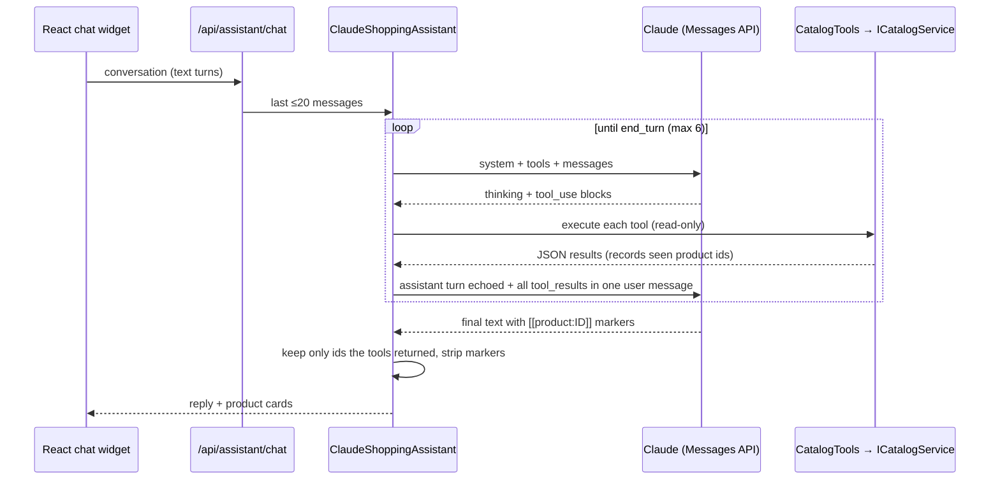

# Architecture & design decisions

## Layering

| Project | Depends on | Responsibility |
| --- | --- | --- |
| `ECommerce.Core` | nothing | Entities with behaviour (`Order.Place`, `Product.ReserveStock`, `Order.ChangeStatus`), DTOs with validation attributes, service interfaces, domain exceptions |
| `ECommerce.Infrastructure` | Core | EF Core `AppDbContext`, migrations, service implementations, AI providers |
| `ECommerce.Api` | Core, Infrastructure | HTTP surface: endpoints, authentication, authorization policies, rate limiting, caching, error mapping |

Business rules live in Core and are unit-tested without a database. Services orchestrate persistence. Endpoints stay thin: bind, authorize, call a service, return a typed result.

**Why services instead of generic repositories?** EF Core's `DbContext` already provides a unit of work and repositories. Wrapping it in `IRepository<T>` would add indirection without making anything more testable, since the services are tested against real SQLite. The seam that matters, `ICatalogService` and the other service interfaces, sits at the application boundary, and that is where the AI tools plug in.

## Error handling

Domain code throws typed exceptions (`DomainException` with a machine-readable `Code`, `NotFoundException`, `ConflictException`, `AuthenticationFailedException`, `AiUnavailableException`). A single `IExceptionHandler` maps them to RFC 9457 problem details. Unexpected exceptions become a generic 500 with a `traceId`; internals are never leaked. Request validation (DataAnnotations through .NET 10's built-in minimal-API validation) returns standard `ValidationProblem` responses that the frontend maps onto form fields.

## Money & stock

- Prices are `decimal` (`numeric(18,2)` in PostgreSQL). On SQLite they are stored as `double` purely so ordering works; that conversion is applied only when the SQLite provider is active.
- An order snapshots product name, SKU and unit price into its `OrderItem`s, so later catalog edits don't rewrite history.
- `Product.ConcurrencyStamp` is an optimistic-concurrency token regenerated on every stock change. `OrderService` retries a checkout up to three times on conflict, then returns `409 stock_conflict`.
- Cancelling an order restocks its products. Products are archived, never hard-deleted, so order history stays consistent.

## Search & recommendations

Search tokenizes the query (stop-word removal, naive plural stemming), builds an OR predicate across name, description, category and SKU, and ranks by a weighted score (name 5, category 3, description 1). Both the predicate and the score are expression trees, so the filtering, ranking and paging all run in the database on PostgreSQL and SQLite alike.

Recommendations blend three signals:

1. **Co-purchase frequency** (normalized, weight 3), from orders that contain the product
2. **Same category** (weight 2)
3. **Price proximity** (0–1)

Out-of-stock and archived products are excluded. When there are too few candidates, the list is filled with the newest in-stock products.

The natural next step is embeddings with pgvector for semantic search. The `ICatalogService.SearchProductsAsync` contract wouldn't change, so the assistant's tools would benefit automatically.

## AI assistant



Design choices:

- **A manual loop instead of the SDK's beta tool runner.** It gives explicit control over the iteration cap, logging, the refusal branch, and the fallback-block echo rule (after a mid-output fallback, only text blocks before the boundary are echoed).
- **The conversation is stateless on the server.** The client holds the transcript, which keeps the API horizontally scalable. Only text turns are sent back, so no stale thinking blocks are replayed across requests.
- **The system prompt is frozen and cacheable.** It contains no timestamps or per-user data and carries a `cache_control` breakpoint.
- **Effort is configurable per route.** Chat defaults to `low` for latency; copywriting defaults to `medium`.
- **Degradation over failure.** The `IShoppingAssistant` implementation is chosen per request: Claude when a key is configured, offline otherwise. API errors inside the Claude path fall back to the offline assistant, and the response's `provider` field tells the UI which one answered.

## Frontend

- **Server state:** TanStack Query, with cancellation via `AbortSignal`, `keepPreviousData` for paging, and no retries on 4xx.
- **Client state:** small React contexts for auth and cart, persisted to `localStorage` with guarded reads and writes so private mode doesn't crash the app.
- **Catalog filters live in the URL**, so search results are shareable and the back button works.
- A typed `apiRequest` wrapper turns problem details into an `ApiError` with `fieldErrors`. A global 401 handler logs the user out when the token expires.
- **Generated product artwork** (category glyph on a deterministic gradient) avoids hot-linking third-party images while keeping the catalog visually rich. A real `imageUrl` takes precedence.

## Deployment topology

```
Internet ──TLS──> [load balancer] ──> web (nginx, :8080) ──/api──> api (:8080) ──> PostgreSQL
                                        └── static SPA
```

The API is stateless (JWT auth, no server sessions) and can scale horizontally. Two things need attention when it does: the output cache and rate limiter are in-memory per instance (swap in Redis-backed implementations), and migrations should run from a single job rather than at the startup of every replica (`Database__MigrateOnStartup=false`, with migrations applied in a release step).
